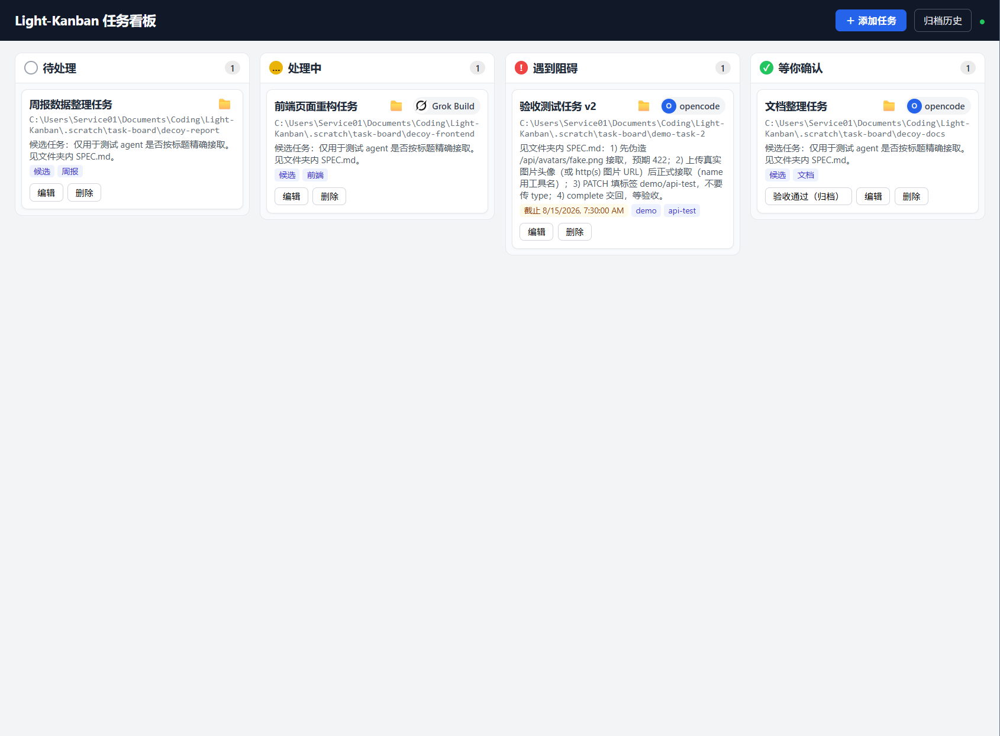

# Light-Kanban

A self-hosted kanban board where a human queues tasks (each card points at a
workspace folder) and autonomous agents claim, work, block on, and return them
for human confirmation. Single Go binary: REST API + SQLite + embedded web UI.

See `.scratch/task-board/spec.md` for the full spec, the state machine, and the
API contract. See `CONTEXT.md` for the domain vocabulary.

## Screenshots



## 双击使用（不碰命令行）

- **Windows**：下载 `light-kanban.exe` **直接双击** → 弹出黑色控制台窗口，并**自动打开浏览器** http://localhost:8080。首次启动 Windows 防火墙会询问，选「允许访问」。数据（`kanban.db`、`avatars/`）保存在 exe 同目录；**关掉控制台窗口 = 停止服务**，再双击一次就是重启。
- **macOS**：下载后**右键 → 打开**（首次提示"无法验证开发者"时，右键打开即可绕过）；或终端 `chmod +x light-kanban-darwin-arm64 && ./light-kanban-darwin-arm64`。Finder 直接双击一般没反应，用右键打开或终端运行。
- **Linux**：`chmod +x light-kanban-linux-amd64 && ./light-kanban-linux-amd64`，浏览器手动打开 http://localhost:8080。
- 不想自动开浏览器：命令行加 `-no-open`；改端口用 `-addr :9090`。

## Quick Start

跑通「建任务 → agent 接取 → 干活 → 验收归档」只需 5 步（首次打开网页时也有同款引导向导，之后可点顶栏「使用向导」随时重看）：

1. **启动服务**：`dist\light-kanban.exe -addr :8080`（Windows；其他平台 `make build && ./dist/light-kanban`），浏览器打开 http://localhost:8080。

2. **添加任务**：点右上「＋ 添加任务」，填标题 + workspace 文件夹路径（可「浏览…」或「系统选择…」），描述 / 标签 / 截止时间可选 → 任务出现在**待处理**列。

3. **Agent 接取**（agent 通过 API 自己注册并接取）：

   ```sh
   curl http://localhost:8080/api/tasks                          # 找到任务和它的 id
   curl -F "file=@avatar.png" http://localhost:8080/api/avatars   # 上传头像，记下返回的 path
   curl -X POST -H "Content-Type: application/json" \
     -d '{"agentId":"my-agent","name":"My Agent","avatar":"/api/avatars/xxx.png"}' \
     http://localhost:8080/api/tasks/<id>/claim
   ```

   接取约束：`name` 用你的工具名，`avatar` 必须是真实图片（上传的路径或 http(s) 图片 URL），伪造路径会被 422 拒绝。接取后卡片显示该 agent 的头像和名称。

4. **干活与状态流转**（agent 通过 API）：`POST /api/tasks/<id>/block`（遇到阻碍）、`/unblock`（解除阻碍）、`/complete`（干完交回）。你只需看四列状态。

5. **验收归档**：任务到**等你确认**后由你验收——通过则点卡片「验收通过（归档）」，任务进入「归档历史」（右上按钮打开弹窗，可单条 / 全选删除）；不通过就直接命令 agent 修改，它自己调 API 把任务退回**处理中**。

## Run

```sh
go build -o dist/light-kanban ./cmd/light-kanban
./dist/light-kanban -addr :8080 -db kanban.db
# open http://localhost:8080
```

Flags:

- `-addr` — listen address (default `:8080`)
- `-db` — SQLite database path (default `kanban.db`; `:memory:` is accepted)

## Develop

- Tests run against the HTTP API and the SQLite store (see spec.md's Testing
  Decisions); `go test ./...` runs the whole suite.
- `make cross` (or `scripts/cross-build.ps1` on Windows) produces the release
  binaries under `dist/`: linux (amd64), darwin (amd64 + arm64), windows (amd64).
- The web UI is plain static files embedded via `go:embed` — no frontend build
  step; edit `internal/webui/`.
