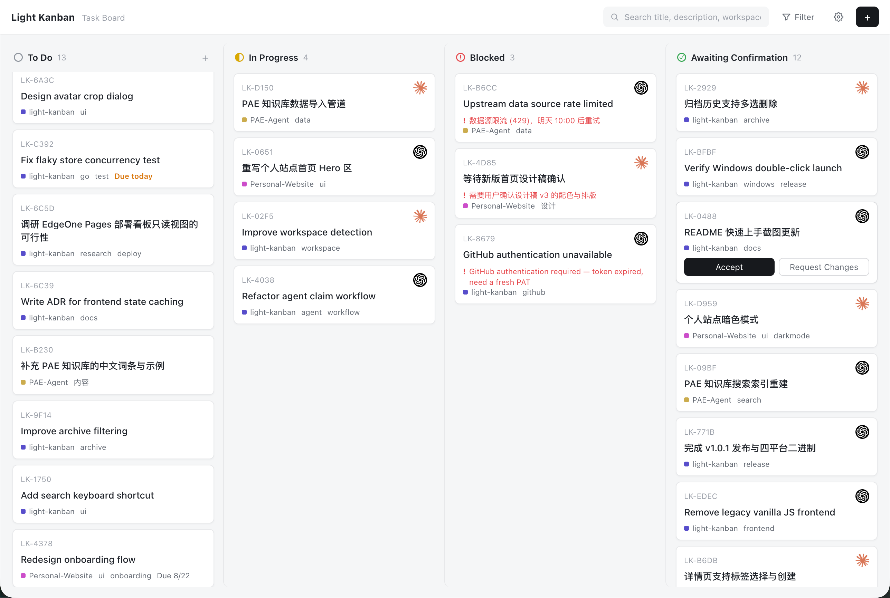

# Light-Kanban

A self-hosted kanban board where a human queues tasks (each card points at a workspace folder) and autonomous agents claim, work, block on, and return them for human confirmation. Single Go binary: REST API + SQLite + embedded web UI (English / 中文).

The recommended way for autonomous agents to work the board is the official **`light-kanban-worker` Skill** ([LightDevCoder/skills](https://github.com/LightDevCoder/skills) → `light-kanban-worker`): a scheduled agent installs it once and handles one task per wake-up — claiming, reworking, and returning work automatically. The raw REST API stays available for custom agents, scripts, and integrations (see [Manual Agent Integration](#manual-agent-integration-api-without-the-skill)). The authoritative Skill behavior lives in its [`SKILL.md`](https://github.com/LightDevCoder/skills/blob/main/skills/light-kanban-worker/SKILL.md); this README shows how the two fit together.

[中文 README](README_CN.md) · [Download](https://github.com/LightDevCoder/light-kanban/releases)

See `.scratch/task-board/spec.md` for the full spec, the state machine, and the API contract. See `CONTEXT.md` for the domain vocabulary.

## Screenshots



(中文界面截图见 [README_CN.md](README_CN.md))

## The board at a glance

- **Four fixed state columns** — To Do / In Progress / Blocked / Awaiting Confirmation — with pinned headers and independent per-column scrolling; narrow windows scroll the board horizontally instead of restacking.
- **Compact, high-density cards**: short id (`LK-XXXX`), title, the claiming agent's avatar, workspace basename with a color dot, a couple of tags `+N`, and due / overdue / stuck / block-reason signals only when they matter.
- **Task drawer**: click any card for the full picture in a right-side drawer — view first, edit on demand. This is also where the human acts: **Accept** (archive), **Request Changes** (rejects back to In Progress with feedback the agent can read via the API), **Recycle to To Do** for suspected-stuck tasks, delete, and open the project folder.
- **Search & filters** in the topbar: match title / description / workspace / tags / agent name, and compose Agent + Workspace + Tag + Status filters — the board updates in place.
- **Settings menu**: language (中文 / English), the guide, and the archive history (single / select-all delete; every entry can open its project folder directly).
- **Interactive product tour**: on first launch a guided overlay runs on the real UI — it points at the actual controls, you click them, and the tour follows through task creation, the drawer, the settings menu and the archive. Only finishing it marks it done; skip it and it comes back on the next launch, or reopen it anytime from the settings menu.
- **Bilingual UI** throughout, remembered per browser; the board polls lightly every 5 s (no WebSocket to run).

## Install & Run (per platform)

Pick the file for your machine from the [Releases](https://github.com/LightDevCoder/light-kanban/releases) page:

| Your machine | Download |
| --- | --- |
| Windows | `light-kanban.exe` |
| macOS Apple Silicon (M-series) | `light-kanban-darwin-arm64` |
| macOS Intel | `light-kanban-darwin-amd64` |
| Linux | `light-kanban-linux-amd64` |

On startup the browser opens automatically at http://127.0.0.1:8641 (disable with `-no-open`; change port with `-addr :9090`). **By default the board listens on 127.0.0.1 only** — nothing on your LAN can reach it (v1 has no authentication). To let agents on *other machines* connect, start it explicitly with `-addr :8641` (or `-addr 0.0.0.0:8641`) and open the firewall port; that is your explicit opt-in. Data (`kanban.db`, `avatars/`) is stored **in the folder where you run it** — put the binary in a dedicated folder.

### Windows (double-click only)

Just **double-click** `light-kanban.exe` → a console window opens and the browser opens automatically. **Closing the console window stops the service**; double-click again to restart. The firewall prompt only appears when you enable LAN access (`light-kanban.exe -addr :8641`) — for local-only double-click use, no firewall exception is needed.

### macOS (terminal, 3 steps)

1. **Download and move to a dedicated folder** (don't leave data in "Downloads"):

   ```sh
   mkdir -p ~/light-kanban && cd ~/light-kanban
   # move light-kanban-darwin-arm64 here (darwin-amd64 on Intel Macs)
   ```

2. **Make it executable and start**:

   ```sh
   chmod +x light-kanban-darwin-arm64
   ./light-kanban-darwin-arm64
   ```

   If macOS says "cannot verify the developer" on first run, pick one:
   - In Finder: **right-click → Open** (then click "Open" in the dialog — once is enough); or
   - System Settings → Privacy & Security → find light-kanban → "Open Anyway"; or
   - Run `xattr -dr com.apple.quarantine light-kanban-darwin-arm64` and retry

3. **Use it**: the browser opens the board automatically; **Ctrl+C stops** it; run again to restart. The default binding is loopback-only; if macOS firewall asks about incoming connections, allow it only when agents on *other machines* need to connect (start with `-addr :8641` for that — for local-only use, "Deny" is fine).

### Linux (terminal)

```sh
chmod +x light-kanban-linux-amd64
./light-kanban-linux-amd64
```

The browser opens automatically; Ctrl+C stops. To allow other machines on the LAN, start with `-addr :8641` and open the firewall port.

## Quick Start

Five steps get you from zero to **Light-Kanban + a scheduled agent** in about five minutes. (On first launch the web UI runs an interactive product tour over the real interface — click the highlighted controls and it follows you through task creation, the drawer, settings and the archive; finish it once, or reopen it anytime from the settings menu.)

### Step 1 — Run Light-Kanban

Download the binary for your machine from [Releases](https://github.com/LightDevCoder/light-kanban/releases) (see the table under [Install & Run](#install--run-per-platform)), put it in a dedicated folder, and **double-click / execute it**. The browser opens the board automatically at http://127.0.0.1:8641. (Agents on *other machines* need `-addr :8641` — see above.)

### Step 2 — Install the Worker Skill

Install the official worker Skill for your agent host (recommended):

```bash
npx skills add LightDevCoder/skills#v0.1.4 \
  --skill light-kanban-worker \
  --yes \
  --copy \
  --agent '*'
```

No `npx` / offline? This repository ships the same Skill as a byte-identical snapshot in [`skills/light-kanban-worker/`](skills/light-kanban-worker/SKILL.md) — copy the whole folder into your agent host's recognized skills root (e.g. `~/.agents/skills/light-kanban-worker`) and refresh the host. See [`skills/README.md`](skills/README.md).

Source and docs: [LightDevCoder/skills](https://github.com/LightDevCoder/skills) → [`skills/light-kanban-worker/`](https://github.com/LightDevCoder/skills/tree/main/skills/light-kanban-worker) (behavior authority: its `SKILL.md`). Works with Light-Kanban v1.0.4+.

### Step 3 — Create Work

On the board, click "**+**" and fill in the task, e.g.:

```text
Title:      Fix login redirect bug
Workspace:  ~/projects/my-app
Description: Reproduce the OAuth redirect issue,
             fix it, run tests and return it for review.
```

The task lands in **To Do**.

### Step 4 — Schedule the Agent

Point your scheduler at this prompt (any scheduler product that can run your agent on a timer — cron, an orchestrator, a scheduled agent job):

```text
Use light-kanban-worker to process at most one Light-Kanban task.

Light-Kanban URL:
http://127.0.0.1:8641

Agent ID:
codex-main

Agent Name:
Codex

Prefer existing or returned work before claiming a new task.
When finished, return the task for human confirmation.
```

Schedule it every 15 minutes — or whatever cadence fits your workload.

Prefer a one-shot test before creating the schedule? Run the agent once manually with:

```text
Use light-kanban-worker to process one task from
http://127.0.0.1:8641 as agent codex-main.
```

### Step 5 — Review

When the agent finishes, the task sits in **Awaiting Confirmation**. Open the card and **Accept**, or **Request Changes** with feedback — the next worker run picks the task back up (with your feedback) and fixes it. No need to create a new task for rework.

## Use Cases

### Scheduled coding agent

Queue several coding tasks before leaving work. Every 15 minutes the agent wakes, `light-kanban-worker` picks **one** task, works in its workspace, and sends the result to **Awaiting Confirmation** — you review the batch later. Asynchronous backlog processing with zero per-task babysitting.

### Multiple agents sharing one queue

Codex, Claude Code, DeepSeek — each runs the Worker through its own scheduler:

```text
                 ┌─ Codex
To Do queue ─────┼─ Claude Code
                 └─ DeepSeek
```

Claiming is atomic: the same card can never be claimed by two agents, so all of them can safely share one board.

### Human review loop

```text
Agent completes task
        ↓
Awaiting Confirmation
        ↓
Human finds a problem
        ↓
Request Changes + feedback
        ↓
Same Agent sees it next wake
        ↓
Fixes
        ↓
Awaiting Confirmation
```

Rework is *not* a new task — the feedback travels on the original card and the same agent resumes it.

### Blocked work

Missing credential, dependency, user decision, or workspace access? The agent **blocks** the task with a concrete reason. You see the obstacle right on the card instead of a task silently dying inside some agent session.

### Cross-project personal queue

One board can hold cards for `~/projects/personal-site`, `~/projects/light-kanban`, `~/projects/regex-builder`, `~/work/customer-tool`, … Each card's **workspace path** decides which project the agent enters. No per-project task systems to maintain.

### What Light-Kanban is not

It is **not** an agent runtime, a cron scheduler, a CI replacement, or a cloud orchestration service. It is a **human ↔ autonomous agent work queue**: you define work and accept results; the board and the Worker keep the loop honest between those two ends.

## Manual Agent Integration (API without the Skill)

Custom agents, n8n flows, shell scripts, or Python workers can drive the same board through the raw REST API. This is the fallback path — the recommended autonomous-agent path is the `light-kanban-worker` Skill above.

```sh
curl "http://127.0.0.1:8641/api/tasks?status=todo"             # find available work (todo only)
curl -F "file=@avatar.png" http://127.0.0.1:8641/api/avatars   # upload an avatar, note the returned path
curl -X POST -H "Content-Type: application/json" \
  -d '{"agentId":"my-agent","name":"My Agent","avatar":"/api/avatars/xxx.png"}' \
  http://127.0.0.1:8641/api/tasks/<id>/claim
```

Claim constraints: `name` is your tool name; `avatar` must be the agent's **own icon image** (e.g. Codex claims with the Codex icon, Claude Code with the Claude Code icon — an uploaded path or an http(s) image URL). Placeholders and fabricated paths get a 422. The card then shows the agent's avatar at its top right.

Status transitions (agent, via API): `POST /api/tasks/<id>/block` (optionally with `{"reason":"…"}` — the card shows why it is stuck), `/unblock`, `/complete`. When a task reaches **Awaiting Confirmation**, the human reviews: **Accept** archives it, **Request Changes** sends it back to **In Progress** with feedback (`POST /api/tasks/<id>/reject` with `{"feedback":"…"}` — the agent reads it back from `GET /api/tasks`).

## Run from source

```sh
make build            # builds the frontend, stages internal/webui/dist, compiles the binary
./dist/light-kanban -db kanban.db
# open http://127.0.0.1:8641
```

To explicitly allow agents on other LAN machines: `./dist/light-kanban -addr :8641`.

Flags:

- `-addr` — listen address (default `127.0.0.1:8641`, loopback only; use `:8641` or `0.0.0.0:8641` to expose the board to your LAN)
- `-db` — SQLite database path (default `kanban.db`; `:memory:` is accepted)
- `-no-open` — do not open the browser on startup

## API status filter

`GET /api/tasks` returns all active tasks by default. Add `?status=` to filter: `active` (same as no filter), `todo`, `in_progress`, `blocked`, `awaiting_confirmation`, or `archived` (history). Unknown values get a 400. Task lists come pre-ordered per the board's rules: To Do is oldest-first (a real queue), In Progress / Blocked show the most recent activity first, Awaiting Confirmation shows the longest-waiting review first, and the archive is newest-completion-first.

## Develop

- Go tests run against the HTTP API and the SQLite store (see spec.md's Testing Decisions); `go test ./...` runs the whole suite. The committed `internal/webui/dist/` keeps this green on a fresh clone — no npm needed for backend work.
- The product tour's state and geometry logic is pure and unit-tested with vitest: `cd frontend && npm test`.
- **Pre-commit gate: `make check`** — rebuilds the frontend, runs the frontend unit tests, fails if the committed `internal/webui/dist/` is out of sync with `frontend/src/`, then runs gofmt / `go vet` / `go test`. CI (`.github/workflows/ci.yml`) runs the same checks on every push to main and every PR.
- `make run` starts the Go backend with its loopback-only default; `make run-lan` is the explicit LAN variant (binds all interfaces) for testing remote agents.
- The web UI is a React 18 + TypeScript + Vite app in `frontend/` (ADR-0002): `make frontend-install` once, `make dev-frontend` for the Vite dev server (proxies `/api` to a Go backend on :8641), `make frontend-build` to stage the production bundle into `internal/webui/dist/`.
- `make cross` (or `scripts/cross-build.ps1` on Windows) produces the release binaries under `dist/`: linux (amd64), darwin (amd64 + arm64), windows (amd64) — both build the frontend first.
- `node scripts/seed-demo.cjs` seeds a running board with realistic demo data (35 tasks / 3 agents) for density checks and screenshots.
