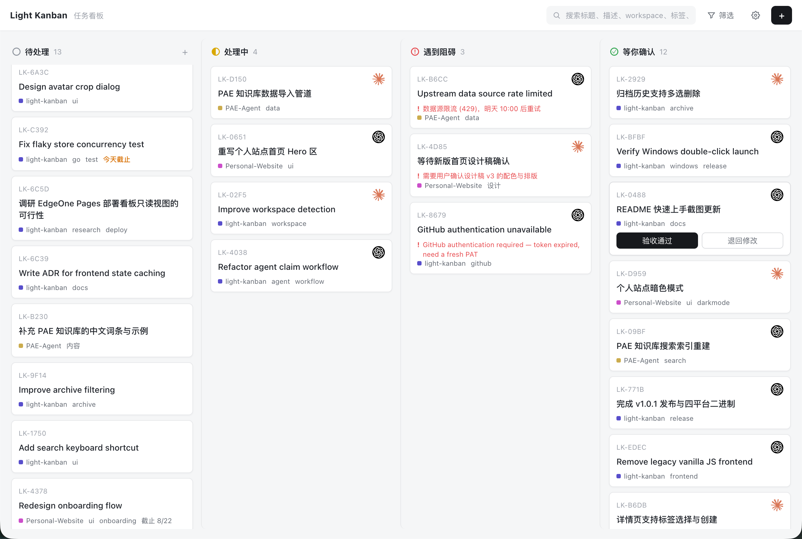

# Light-Kanban 任务看板

自托管看板：人类添加任务（每张卡指向一个 workspace 文件夹），自主 AI agent 通过语言无关的 REST API 接取、干活、上报阻碍、完成后交回，人类验收归档。单个 Go 二进制：REST API + SQLite + 内嵌网页（界面支持中文 / English）。

自主 agent 接活、返工、交回的推荐方式是官方 **`light-kanban-worker` Skill**（[LightDevCoder/skills](https://github.com/LightDevCoder/skills) → `light-kanban-worker`）：定时 agent 安装一次即可，每次唤醒处理一张卡，自动完成领取、返工与交回。原始 REST API 对自定义 agent、脚本与集成仍然开放（见[手动 Agent 接入（不装 Skill 的 API 方式）](#手动-agent-接入api-方式不装-skill)）。Skill 行为的权威来源是其 [`SKILL.md`](https://github.com/LightDevCoder/skills/blob/main/skills/light-kanban-worker/SKILL.md)；本 README 只说明两者如何配合。

[English README](README.md) · [下载（Releases）](https://github.com/LightDevCoder/light-kanban/releases)

完整规范、状态机与 API 契约见 `.scratch/task-board/spec.md`；领域词汇见 `CONTEXT.md`。

## 界面截图



(English UI screenshot: see [README.md](README.md))

## 看板一览

- **固定四列状态** —— 待处理 / 处理中 / 遇到阻碍 / 等你确认 —— 列头固定、每列独立滚动；窗口变窄时看板横向滚动，不会重排成单列。
- **高密度紧凑卡片**：短号（`LK-XXXX`）、标题、接取 agent 的头像、workspace 文件夹名（带颜色点）、最多两个标签 `+N`，只有截止 / 逾期 / 疑似卡住 / 阻碍原因这类真正需要关注的信号才带颜色。
- **任务抽屉**：点任意卡片从右侧打开完整详情——默认查看模式，需要时再进入编辑。人类的主要操作都在这里：**验收通过**（归档）、**退回修改**（带反馈退回处理中，agent 可通过 API 读到）、**回收到待处理**（疑似卡住任务）、删除、打开项目文件夹。
- **顶栏搜索与筛选**：匹配标题 / 描述 / workspace / 标签 / Agent 名；筛选支持 Agent + Workspace + 标签 + 状态自由组合，结果直接作用在看板上。
- **设置菜单**：界面语言（中文 / English）、使用指南、归档历史（单条 / 全选删除；每条记录都能直接打开对应项目目录）。
- **交互式产品导览**：首次打开时在**真实界面上**运行引导——高亮指向真实控件，你亲自点击，导览跟着你走完新建任务、任务抽屉、设置菜单和归档历史。只有完整走到「完成」才会标记为已看完；跳过的话下次启动还会出现，之后也可以随时从设置菜单重新打开。
- **完整双语界面**，按浏览器记忆选择；5 秒轻量轮询（无需 WebSocket）。

## 安装与运行（按平台）

从 [Releases](https://github.com/LightDevCoder/light-kanban/releases) 页面下载对应你电脑的文件：

| 你的电脑 | 下载文件 |
| --- | --- |
| Windows | `light-kanban.exe` |
| macOS Apple Silicon（M 系列） | `light-kanban-darwin-arm64` |
| macOS Intel | `light-kanban-darwin-amd64` |
| Linux | `light-kanban-linux-amd64` |

启动后会**自动打开浏览器** http://127.0.0.1:8641（不想自动开：加 `-no-open`；换端口：`-addr :9090`）。**默认只监听本机 127.0.0.1**——局域网里没有任何机器能访问（v1 没有认证）。要让**其他电脑**上的 agent 连过来，需要显式用 `-addr :8641`（或 `-addr 0.0.0.0:8641`）启动并放行防火墙端口——这是你的主动选择。数据（`kanban.db`、`avatars/`）保存在**你运行命令时所在的文件夹**，建议专门建一个文件夹放二进制和数据。

### Windows（可以纯双击）

直接**双击** `light-kanban.exe` → 弹出黑色控制台窗口并自动打开浏览器。**关掉控制台窗口 = 停止服务**，再双击一次就是重启。只有开启局域网访问（`light-kanban.exe -addr :8641`）时才会触发防火墙询问；纯本机双击使用不需要任何防火墙例外。

### macOS（终端运行，3 步）

1. **下载并放到专用文件夹**（不要把数据留在「下载」里）：

   ```sh
   mkdir -p ~/light-kanban && cd ~/light-kanban
   # 把 light-kanban-darwin-arm64 移到这个文件夹（Intel Mac 用 darwin-amd64）
   ```

2. **给执行权限并启动**：

   ```sh
   chmod +x light-kanban-darwin-arm64
   ./light-kanban-darwin-arm64
   ```

   首次运行如果提示"无法验证开发者"，任选其一：
   - Finder 里**右键 → 打开**（在弹窗里再点「打开」，只需一次）；或
   - 系统设置 → 隐私与安全性 → 找到 light-kanban → 点「仍要打开」；或
   - 终端执行 `xattr -dr com.apple.quarantine light-kanban-darwin-arm64` 后重跑

3. **使用**：浏览器自动打开看板；终端里 **Ctrl+C 停止**，再次运行就是重启。默认只监听本机；如果 macOS 防火墙询问"允许 incoming connections"，只有需要让**其他电脑**上的 agent 连过来时才选允许（那种场景还要用 `-addr :8641` 启动——只用本机的话选拒绝也能用）。

### Linux（终端运行）

```sh
chmod +x light-kanban-linux-amd64
./light-kanban-linux-amd64
```

浏览器自动打开看板，Ctrl+C 停止。需要让局域网其他电脑访问时，用 `-addr :8641` 启动并放行防火墙端口。

## Quick Start

五步从零跑通「**Light-Kanban + 定时 Agent**」，大约五分钟。（首次打开网页时会在**真实界面上**自动运行交互式产品导览——点击高亮的真实控件，导览会带你走完新建任务、任务抽屉、设置菜单与归档历史；完整走完一次即标记完成，之后可在右上「设置」菜单里随时重看。）

### 第一步 — 运行 Light-Kanban

从 [Releases](https://github.com/LightDevCoder/light-kanban/releases) 下载对应你电脑的二进制（见上文[安装与运行](#安装与运行按平台)的表格），放进专用文件夹，**双击 / 直接执行**。浏览器自动打开看板 http://127.0.0.1:8641。（**其他电脑**上的 agent 需要 `-addr :8641`——见上文。）

### 第二步 — 安装 Worker Skill

给你的 agent host 安装官方 worker Skill（推荐）：

```bash
npx skills add LightDevCoder/skills#v0.1.5 \
  --skill light-kanban-worker \
  --yes \
  --copy \
  --agent '*'
```

没有 npx / 离线环境？本仓库自带同一 Skill 的**逐字节快照**（[`skills/light-kanban-worker/`](skills/light-kanban-worker/SKILL.md)）——把整个目录复制到 agent host 认可的 skills root（例如 `~/.agents/skills/light-kanban-worker`），刷新 host 即可。详见 [`skills/README.md`](skills/README.md)。

来源与文档：[LightDevCoder/skills](https://github.com/LightDevCoder/skills) → [`skills/light-kanban-worker/`](https://github.com/LightDevCoder/skills/tree/main/skills/light-kanban-worker)（行为权威：其 `SKILL.md`）。兼容 Light-Kanban v1.0.4+。

### 第三步 — 创建任务

在看板上点「**+**」填写任务，例如：

```text
标题：      修复登录跳转 bug
Workspace：~/projects/my-app
描述：      复现 OAuth 跳转问题，
            修复、跑测试并交回验收。
```

任务进入**待处理**。

### 第四步 — 定时调度 Agent

把下面这段 prompt 交给你的 scheduler（任何能定时运行 agent 的产品——cron、编排器、定时 agent 任务均可）：

```text
Use light-kanban-worker to process at most one Light-Kanban task.

Light-Kanban URL:
http://127.0.0.1:8641

Agent ID:
codex-main

Agent Name:
Codex

Agent Avatar:
/path/to/codex-icon.png

Prefer existing or returned work before claiming a new task.
When finished, return the task for human confirmation.
```

Avatar 只在**这个 Agent ID 第一次注册**时需要；之后的运行复用 Light-Kanban
保存的身份。

把这个 schedule 配置为 codex-main 的 max concurrency = 1：上一个
codex-main run 还在运行时，不要再启动新的 run。不同 Agent ID 可以并发运行，
但同一个 Agent ID 的两个 run 不得重叠。

每 15 分钟调度一次——或按你的工作负载选择节奏。

想先手动测一次再建定时任务？用能完成首次注册的完整一次性 prompt：

```text
Use light-kanban-worker to process one Light-Kanban task.

Light-Kanban URL:
http://127.0.0.1:8641

Agent ID:
codex-main
Agent Name:
Codex
Agent Avatar:
/path/to/codex-icon.png
```

首次注册成功后，可以简化为：

```text
Use light-kanban-worker to process one task from
http://127.0.0.1:8641 as agent codex-main.
```

### 第五步 — 验收

Agent 完成后，任务进入**等你确认**。打开卡片——**验收通过**，或**退回修改**并附反馈：下一次 worker 运行会带着你的反馈继续处理原任务。返工不需要新建任务。

## Use Cases（使用场景）

### 定时编码 Agent

下班前排好几张编码任务。每 15 分钟 agent 醒来一次，`light-kanban-worker` 领取**一张**任务、在对应 workspace 里干活、把结果送到**等你确认**——你稍后批量验收。异步积压工作，零逐卡跟进。

### 多个 Agent 共享一个队列

Codex、Claude Code、DeepSeek——各自通过自己的 scheduler 运行 Worker：

```text
                 ┌─ Codex
待处理队列 ────────┼─ Claude Code
                 └─ DeepSeek
```

领取是原子的：同一张卡不会被两个 Agent 同时领取，多个 Agent 可以安全共用一块看板。不同 Agent ID 可以并发运行；同一个 Agent ID 的多个 run 不得重叠——给每个 scheduler 配置其 Agent ID 的 max concurrency = 1。

### 长任务与调度间隔

如果任务耗时超过调度间隔，同一 Agent 的下一次唤醒必须跳过，直到当前 run
结束。示例：每 15 分钟调度一次，任务耗时 40 分钟。

```text
08:00 run
08:15 skip
08:30 skip
08:40 结束
08:45 允许下一次 run
```

Worker 契约要求 scheduler 强制执行这一点（每个 Agent ID 的 max
concurrency = 1）；看板本身不向 agent 出租 run。

### 人工验收闭环

```text
Agent 完成任务
        ↓
等你确认
        ↓
人类发现问题
        ↓
退回修改 + 反馈
        ↓
同一 Agent 下次唤醒发现
        ↓
修复
        ↓
等你确认
```

返工**不是**新建任务——反馈跟着原卡走，同一个 Agent 继续处理。

### 遇到阻碍

缺凭据、缺依赖、需要用户拍板、workspace 不可访问？Agent 直接 **block** 任务并写明具体原因。你在卡片上一眼看到阻碍原因，而不是任务无声死在某次 Agent session 里。

### 跨项目个人队列

一块看板可以同时放 `~/projects/personal-site`、`~/projects/light-kanban`、`~/projects/regex-builder`、`~/work/customer-tool`……每张卡的 **workspace 路径**决定 Agent 进入哪个项目。不用为每个项目维护一套任务系统。

### Light-Kanban 不是什么

它**不是** agent runtime、不是 cron scheduler、不是 CI 替代品、不是云编排服务。它是**人类 ↔ 自主 agent 的工作队列**：你定义工作、验收结果；看板与 Worker 在这两端之间维持闭环。

## 手动 Agent 接入（API 方式，不装 Skill）

自定义 agent、n8n 流程、shell 脚本或 Python worker 可以直接用原始 REST API 驱动同一块看板。这是备用路径——自主 agent 的推荐路径是上面的 `light-kanban-worker` Skill。

```sh
curl "http://127.0.0.1:8641/api/tasks?status=todo"             # 找可接的活（只看待处理）
curl -F "file=@avatar.png" http://127.0.0.1:8641/api/avatars   # 上传头像，记下返回的 path
curl -X POST -H "Content-Type: application/json" \
  -d '{"agentId":"my-agent","name":"My Agent","avatar":"/api/avatars/xxx.png"}' \
  http://127.0.0.1:8641/api/tasks/<id>/claim
```

接取约束：`name` 用你的工具名，`avatar` 必须是 **agent 自己的图标图片**（例如 Codex 用 Codex 图标、Claude Code 用 Claude Code 图标——上传后的路径或 http(s) 图片 URL），占位图或伪造路径会被 422 拒绝。接取后卡片右上角显示该 agent 的头像。

原子领取防止**不同** agent 同时领取同一张待处理卡。它不协调**同一个
agentId** 的重叠执行——那是 scheduler 的职责（每个 agentId 的 max
concurrency = 1）。

状态流转（agent 通过 API）：`POST /api/tasks/<id>/block`（可带 `{"reason":"…"}`，卡片会直接显示卡住原因）、`/unblock`（解除阻碍）、`/complete`（干完交回）。任务到**等你确认**后由人类验收：**验收通过**即归档；**退回修改**则带着反馈退回处理中（agent 调 `POST /api/tasks/<id>/reject` 带 `{"feedback":"…"}` 亦可，反馈可从 `GET /api/tasks` 读到）。

## 从源码运行

```sh
make build            # 构建前端 → 拷入 internal/webui/dist → 编译二进制
./dist/light-kanban -db kanban.db
# 打开 http://127.0.0.1:8641
```

要让**其他电脑**上的 Agent 连过来（显式开放局域网）：`./dist/light-kanban -addr :8641`。

参数：

- `-addr` — 监听地址（默认 `127.0.0.1:8641`，仅本机；用 `:8641` 或 `0.0.0.0:8641` 可向局域网开放）
- `-db` — SQLite 数据库路径（默认 `kanban.db`；支持 `:memory:`）
- `-no-open` — 启动时不自动打开浏览器

## API 状态过滤

`GET /api/tasks` 默认返回全部活跃任务。加 `?status=` 可按状态过滤：`active`（等同无过滤）、`todo`、`in_progress`、`blocked`、`awaiting_confirmation`、`archived`（历史）；非法值返回 400。返回列表已按看板规则排好序：待处理最老在前（真正的队列）、处理中 / 遇到阻碍最近活动在前、等你确认等待最久在前、归档最近完成在前。

## Develop

- 测试跑在 HTTP API 与 SQLite store 两个接缝上（见 spec.md 的 Testing Decisions）；`go test ./...` 跑全量。前端产物已提交在 `internal/webui/dist/`，fresh clone 不装 npm 也能通过。
- 产品导览的状态与几何逻辑是纯函数，用 vitest 单测覆盖：`cd frontend && npm test`。
- **提交前检查：`make check`**——重建前端，跑前端单测，若提交的 `internal/webui/dist/` 与 `frontend/src/` 不同步则失败，然后跑 gofmt / `go vet` / `go test`。CI（`.github/workflows/ci.yml`）对每次 push 到 main 和每个 PR 执行同样检查。
- `make run` 以默认的本机监听启动 Go 后端；`make run-lan` 是显式开放局域网的变体（绑定全部网卡），用于测试远端 agent。
- 网页 UI 是 `frontend/` 下的 React 18 + TypeScript + Vite 应用（见 ADR-0002）：首次 `make frontend-install`；开发用 `make dev-frontend`（Vite :5173，代理 `/api` 到 :8641 的 Go 后端）；`make frontend-build` 把生产包 staged 到 `internal/webui/dist/`。
- `make cross`（Windows 用 `scripts/cross-build.ps1`）产出 `dist/` 下的发布二进制：linux (amd64)、darwin (amd64 + arm64)、windows (amd64)——两者都会先构建前端。
- `node scripts/seed-demo.cjs` 给运行中的看板灌入演示数据（35 任务 / 3 agent），用于密度测试与截图。
